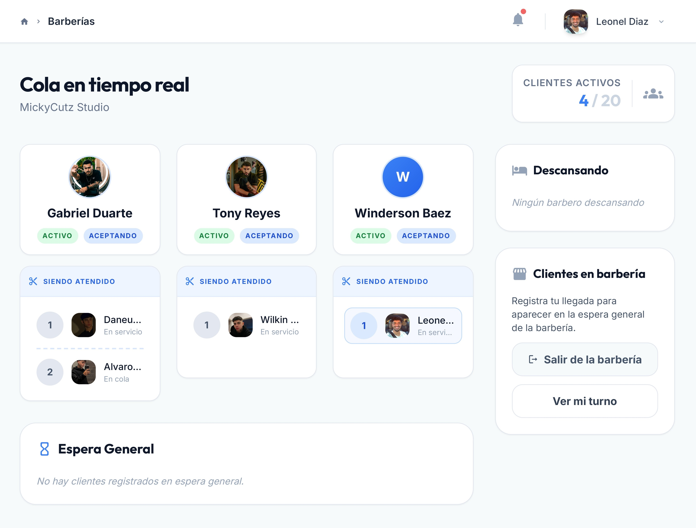
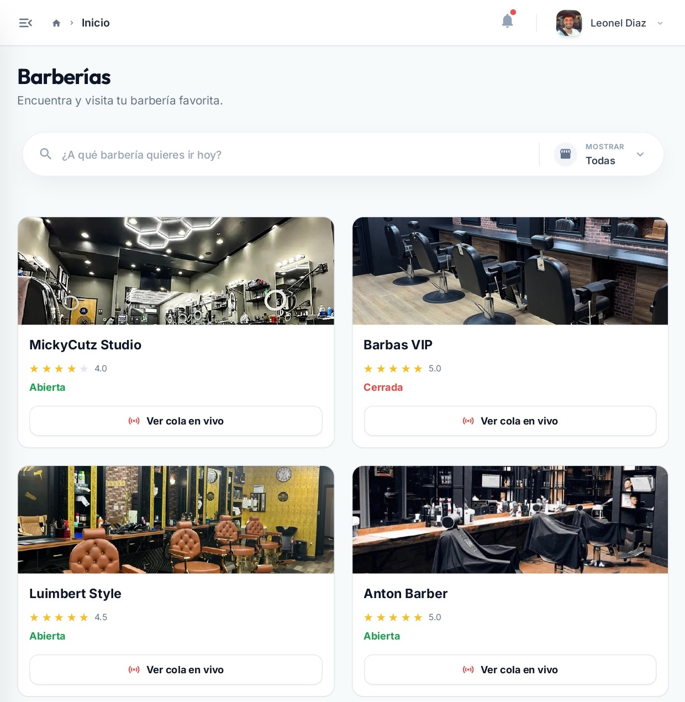
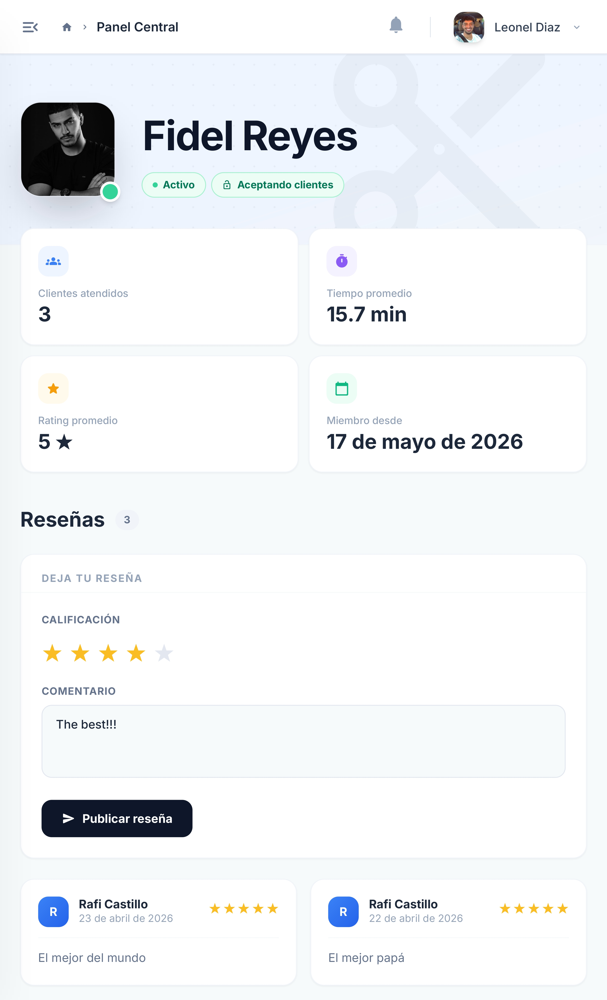
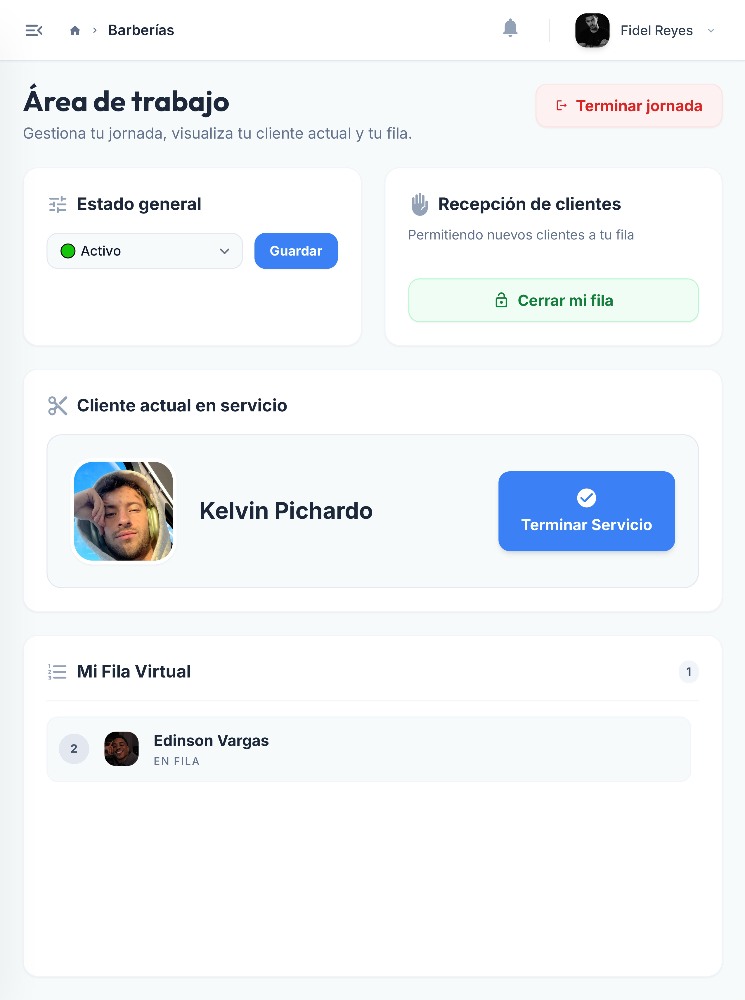
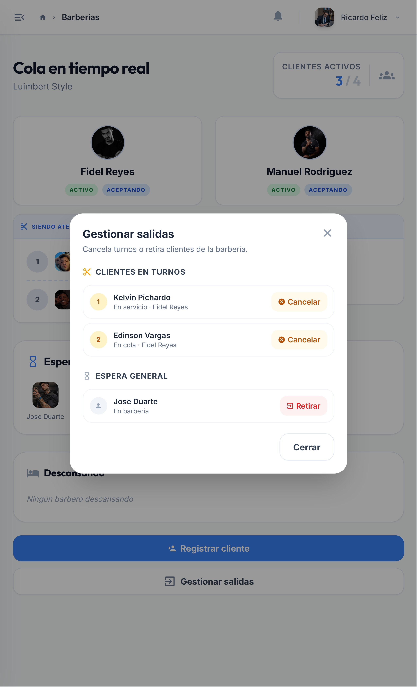
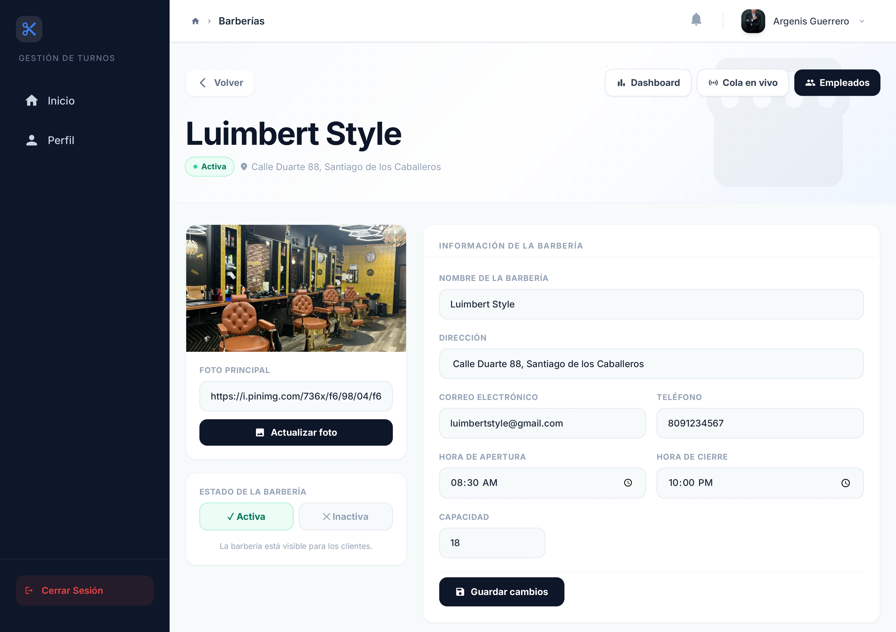

# BarberQueue

BarberQueue is a web application designed to improve the waiting experience at barbershops in the Dominican Republic. It provides real-time queue visualization, group handling, barber preference management, and basic administration tools so customers and businesses can better manage time, reduce uncertainty, and improve satisfaction.



---

## Table of Contents

- [Motivation](#motivation)
- [Solution](#solution)
- [Out of Scope](#out-of-scope)
- [Installation](#installation)
  - [Requirements](#requirements)
  - [Install Dependencies](#install-dependencies)
  - [`.env` Configuration](#env-configuration)
  - [Database Setup](#database-setup)
- [Run Locally](#run-locally)
- [Run Tests](#run-tests)
- [API Documentation](#api-documentation)
- [Roles \& Permissions](#roles--permissions)
- [Test Accounts](#test-accounts)
- [Contributing](#contributing)
- [Authors](#authors)
- [License](#license)

---

## Motivation

Barbershops are face-to-face businesses where clients must be physically present. A simple "one-in, one-out" model is impractical: barbershops expect a steady flow of clients and frequently multiple clients are present at once. This generates queues that create uncertainty, frustration, and lost time for customers who cannot know how long they will wait or what position they hold in the queue.

Current challenges this project addresses:

- Clients cannot easily know how many people are ahead of them unless they are physically inside the barbershop.
- Groups (families or friends) arriving together increase queue length and complicate ordering.
- Client preferences for specific barbers alter queue behavior and increase uncertainty for those who arrive later.

---

## Solution

BarberQueue gives customers and barbershops the tools to manage queues in real time:

- Clients see live queue length and their current position.
- Group handling lets family members join and move through the queue together.
- Barber preference selection lets clients choose a favorite barber or accept the next available one.
- Administrative views and management tools support barbershop staff at every level.



---

## Out of Scope

The following are explicitly out of scope for the current version:

- Management of multiple branches per barber business.
- Payment gateway integration (subscriptions and promotions).
- Push notifications and complex trigger-based notification systems.

---

## Installation

### Requirements

| Tool                                                     | Version   |
| -------------------------------------------------------- | --------- |
| [PHP](https://www.php.net/downloads.php)                 | >= 8.4    |
| [Composer](https://getcomposer.org/download/)            | >= 2.8.9  |
| [Node.js](https://nodejs.org/en/download)                | >= 22.0.0 |
| [Python](https://www.python.org/downloads/)              | >= 3.13.9 |
| [MySQL](https://downloads.mysql.com/archives/community/) | >= 8.0.42 |

---

### Install Dependencies

#### PHP

From the `backend/` folder:

```bash
cd backend
composer install
```

---

#### JavaScript

From the `frontend/` folder:

```bash
cd frontend
npm install
```

---

#### Python

Install [uv](https://docs.astral.sh/uv/getting-started/installation/):

```bash
# Windows
powershell -ExecutionPolicy ByPass -c "irm https://astral.sh/uv/install.ps1 | iex"

# macOS / Linux
curl -LsSf https://astral.sh/uv/install.sh | sh
```

Then install dependencies from the `tests/` folder:

```bash
cd tests
uv sync
```

> **VS Code:** open the Command Palette (`Ctrl+Shift+P`), run **Python: Select Interpreter**, and choose the `.venv` inside `tests/`. Reload your terminal afterwards.

---

### `.env` Configuration

Create a `.env` file at the **repo root** and fill in the required values:

```env
# Application
APP_NAME=BarberQueue
APP_ENV=development
APP_TIMEZONE=America/Santo_Domingo

# URLs
BACKEND_URL=http://localhost:3000
FRONTEND_URL=http://localhost:5173

# Database
DB_HOST=
DB_PORT=
DB_USERNAME=
DB_PASSWORD=
DB_DATABASE=barberqueue_db

# Security & Authentication
JWT_SECRET=

# Mail Service
MAIL_USERNAME=
MAIL_PASSWORD=

# External Services (optional)
GOOGLE_CLIENT_ID=
GOOGLE_CLIENT_SECRET=
```

#### Environment Modes

The application switches behavior based on the `APP_ENV` variable:

- **`development`**: Standard mode. Emails are sent using the credentials in `.env` and all data is written to the production database (`DB_DATABASE`).

- **`testing`**: Test mode. Real emails are suppressed to avoid sending noise during automated test runs, and all data is written to a separate test database to keep it fully isolated from production.

> Test mode is also activated on a per-request basis when the backend receives the `X-App-Env: testing` HTTP header, regardless of `APP_ENV`. Backend tests send this header automatically, so you can run tests against a `development` server without changing your `.env`.

---

#### JWT Secret

Generate a strong random value and set it as `JWT_SECRET`:

```bash
openssl rand -base64 32
```

---

#### Mail Service Setup

`MAIL_USERNAME` must be a Gmail address. `MAIL_PASSWORD` is not your Gmail password; it is an **App Password** generated specifically for this application.

1. Go to [myaccount.google.com/security](https://myaccount.google.com/security) and enable **2-Step Verification** if you haven't already. App Passwords require this to be active.
2. Go to [myaccount.google.com/apppasswords](https://myaccount.google.com/apppasswords), create a new **App Password**, and copy the generated value into `MAIL_PASSWORD`.

---

#### Google OAuth Setup (Optional)

##### Step 1. Create a Google Cloud project

1. Go to [console.cloud.google.com](https://console.cloud.google.com/).
2. Click the project dropdown at the top and select **New project**.
3. Give it a name and click **Create**.

##### Step 2. Configure the OAuth consent screen

1. Go to **APIs & Services** > **OAuth consent screen**.
2. Select **External** as the user type and click **Create**.
3. Fill in the required fields:
   - **App name**: the value of `APP_NAME`
   - **User support email**: the value of `MAIL_USERNAME`
   - **Developer contact email**: the value of `MAIL_USERNAME`
4. Click **Save and continue** through the remaining steps.

##### Step 3. Create OAuth credentials

1. Go to **APIs & Services** > **Credentials**.
2. Click **Create credentials** > **OAuth client ID**.
3. Set the **Application type** to **Web application**.
4. Under **Authorized redirect URIs**, click **Add URI** and enter:

   ```plain
   {BACKEND_URL}/api/auth/google
   ```

   Replace `{BACKEND_URL}` with the value from your `.env` (e.g. `http://localhost:3000/api/auth/google`).

5. Click **Create**.

**Step 4. Copy credentials to `.env`**

A dialog will show your credentials. Copy them into your `.env`. You can also retrieve them at any time from the **Credentials** page by clicking on your OAuth client.

---

### Database Setup

From the **repo root**:

```bash
php scripts/install-db.php
```

This creates and seeds two databases: one for local development and one for running tests.

Both share the same schema (`creation.sql`, `triggers.sql`) but differ in seed data. The development database is filled with realistic examples so you can start using the app immediately. The test database uses a controlled, minimal dataset designed to support specific test scenarios.

---

## Run Locally

### Backend <!-- omit in toc -->

**Option A. Start the built-in PHP server manually:**

From the **repo root**:

```bash
php -S localhost:3000 -t backend
```

Use `Ctrl+C` to stop.

---

**Option B. Use a VS Code extension (recommended):**

1. Install the **PHP Server** extension (`brapifra.phpserver`), listed in `.vscode/extensions.json`.
2. Open the Command Palette (`Ctrl+Shift+P`) and run **PHP Server: Reload project**.

Use **PHP Server: Stop project** to stop.

---

### Frontend <!-- omit in toc -->

From the `frontend/` folder:

```bash
cd frontend
npm run dev
```

Open the URL configured in `FRONTEND_URL` in your browser. Use `Ctrl+C` to stop.

---

## Run Tests

From the `tests/` folder:

```bash
cd tests
uv run pytest
```

Results are saved to `tests/results/`, including an HTML report with pass/fail summaries.

> Tests require the PHP server to be running at `BACKEND_URL`.

---

## API Documentation

The full API reference is available in [`docs/ROUTES.md`](docs/ROUTES.md). It covers every endpoint, request body, response shape, and optional fields.

A [Postman collection](docs/BarberQueue.postman_collection.json) is also included. Import it directly into Postman via **File > Import** to get every route pre-configured against `BACKEND_URL`.

---

## Roles & Permissions

Four roles exist in the system:

### `client` <!-- omit in toc -->

- Browse available barbershops and view their live queue.
- Join or leave a queue as an individual or as a group.
- Choose a preferred barber or opt for the next available one.
- View personal turn details and, if in a group, view other members' turns and the group wait estimate.
- Leave reviews for barbers and barbershops.



### `barber` <!-- omit in toc -->

- Sign in and out of service shifts and mark breaks.
- View their personal queue with detailed information on assigned turns.
- Start and finish service for a client.
- Access personal statistics and historical performance metrics.



### `assistant` <!-- omit in toc -->

- Enqueue clients and groups on behalf of customers.
- Access a staff-facing view of the live queue to support front-desk operations.
- Perform limited actions to support barbers (e.g. mark client as away).



### `admin` <!-- omit in toc -->

Full management of one or more barbershops they administer:

- CRUD operations for employees (barbers and assistants).
- Manage rules and settings: visibility, open/close times, and maximum concurrent clients.
- Upload and manage barbershop photos.
- View business-level dashboards and metrics.
- Moderate client reviews.



---

## Test Accounts

Four sample accounts are included for testing. Password for all: `app12345`

| Email                                                           | Role        |
| --------------------------------------------------------------- | ----------- |
| [francisco.garcia@gmail.com](mailto:francisco.garcia@gmail.com) | `client`    |
| [gabriel.duarte@gmail.com](mailto:gabriel.duarte@gmail.com)     | `barber`    |
| [frankie.jimenez@gmail.com](mailto:frankie.jimenez@gmail.com)   | `assistant` |
| [rafael.almonte@gmail.com](mailto:rafael.almonte@gmail.com)     | `admin`     |

---

## Contributing

Contributions are welcome. Suggested workflow:

1. Fork the repository.
2. Create a feature branch: `feat/my-change`.
3. Make your changes following the existing code style.
4. Include appropriate documentation or tests.
5. Commit, push, and open a pull request describing the change and the reason for it.

### Pre-commit Hooks <!-- omit in toc -->

This project uses [pre-commit](https://pre-commit.com/) to enforce code quality checks before each commit. Run once from the **repo root** to set it up:

```bash
pip install pre-commit
pre-commit install
```

Checks run automatically on every `git commit`. To run them manually:

```bash
pre-commit run --all-files
```

---

## Authors

| Name                            | Contact                                                    |
| ------------------------------- | ---------------------------------------------------------- |
| Roniel Antonio Sabala Germán    | [ronielsabala@gmail.com](ronielsabala@gmail.com)           |
| Yerelin Vanessa Rosario Taveras | [yerelinrosario26@gmail.com](yerelinrosario26@gmail.com)   |
| Jheinel Jesús Brown Curbata     | [jheinelbrown@gmail.com](jheinelbrown@gmail.com)           |
| Idelka Regina Rodríguez Jáquez  | [rodriguezidelka17@gmail.com](rodriguezidelka17@gmail.com) |

---

## License

This project is available under the **MIT License**.
